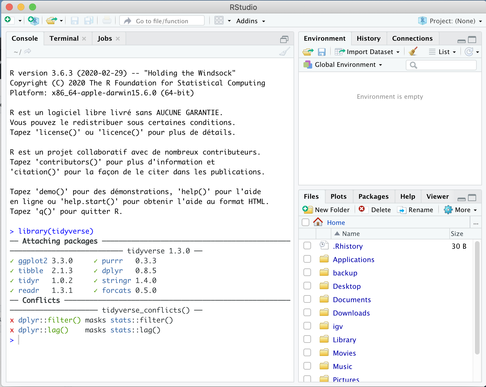

**Où:** Salle 109 du batiment 9 (IMAG), au premier étage

**Quand:** 15/10/2020, 14h-17h

**Instructeurs:** 
[Sandra Cortijo](mailto:sandra.cortijo@hotmail.fr), 
[Isabelle Sanchez](mailto:Isabelle.Sanchez@inrae.fr)

**A faire avant le cours:** 
Les participants doivent amener leur ordinateur sur lequel R et R studio sont installés.
[Installer R](https://cran.biotools.fr/),
[Installer Rstudio](https://rstudio.com/products/rstudio/download/)

Vous devez aussi avoir le package **ggplot** installé. 
Pour cela taper dans la console R de Rstudio: install.packages("ggplot2")

**Prérequis:** 
Les participant doivent déjà avoir des bases de R et savoir utiliser Rstudio. Si ce n'est pas le cas, veuillez vous inscrire pour une formation R avant de venir à la formation ggplot.

### Description

Ce cours va vous apprendre comment utiliser le package **ggplot** de **R** afin de réaliser des graphiques, en partant des données tabulaires (ce que vous pourriez créer en utilisant excel).

Le jeu de données que nous allons utiliser en exemple à été publié par 
[Burghardt .. Schmitt (2015)](https://doi.org/10.1111/nph.13799). 

### Course Materials

#### Module 1 

[File organisation](module01_data_and_files/materials/file_organisation.md)

[Data organisation](module01_data_and_files/materials/data_organisation.md)

[Intro to R and read your data into R](module01_data_and_files/materials/brief_r_intro.html)

#### Module 2

[Data visualisation](module02_data_viz_ggplot/materials/ggplot_lesson.html) 
([exercise solutions](module02_data_viz_ggplot/materials/ggplot_exercise_solutions.html))

#### Module 3

[Data manipulation](module03_advanced_data_manipulation_dplyr/materials/dplyr_lesson.html)

#### Module 4

[Advanced data manipulation](module04_practice/materials/advanced_dplyr_lesson.html)

[Practice exercise](https://raw.githubusercontent.com/tavareshugo/slcu_r_course/master/module04_practice/materials/practice_template.R)

[Dataset](https://raw.githubusercontent.com/tavareshugo/slcu_r_course/master/module04_practice/data/TPM-light-WT-17c-27c-RNA-seq-average-rep1-rep2_misexpressed.tsv)

[Solutions!](module04_practice/materials/practice_solutions.html)

### Further resources

The University runs several introduction courses on R and other topics (bioinformatics, image analysis, etc.):

- [Full course list](https://www.training.cam.ac.uk/search?course_type_facet_shown=&scheduled=on&course_date_facet_shown=true&course_availability_facet_shown=&provider_1345591=on&provider_facet_shown=&scrollPos=627)
    - Intro to statistics (using R): https://www.training.cam.ac.uk/event/2235484

### Software installation

You will need a laptop with the following software installed:

- R ([download](https://cran.rstudio.com/))
- RStudio ([download](https://www.rstudio.com/products/rstudio/download/#download))

In each case, download the relevant installer for your operating system (Mac, 
Windows and Linux versions are available) and install the programs as you would 
do normally.

After installing both of those programs, we would ask you to install some _R_ 
packages (these are like "extensions" to add extra functionality to _R_):

1. Make sure you're connected to the internet
2. Open RStudio
3. In the top menu choose `Tools > Install Packages...`
4. Type the following in the "Packages" box: `tidyverse,visdat,plotly`
5. Click "Install" and the installation should happen automatically

Please confirm that the packages are properly installed by doing the following:

1. Open RStudio
2. In the "Console" panel (bottom left) type the following commands, one at a 
time:
    - `library(tidyverse)`
    - `library(visdat)`
    - `library(plotly)`
3. The output should be similar to what is shown in the screenshot below. If 
you get a message, such as: 
"Error in library(tidyverse): there is no package called 'tidyverse'"
**please get in touch with one of the instructors before the course**.

