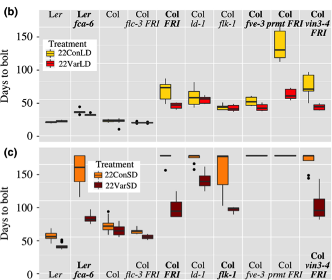

```{r setup, include=FALSE}
knitr::opts_chunk$set(echo = TRUE)
```

[Retour à la page d'accueil](https://scortijo.github.io/ggplot_course/)

# Visualisation de données avec ggplot2

Lors de cette formation nous allons apprendre à visualiser des jeux de données tabulaires avec [``ggplot2``](http://ggplot2.org/).


## Mise en place

Lors de cette formation nous allons ustiliser plusieurs packages qui contienent les fonctions dont nous avons besoin:
- `tidyverse` qui contient plusiers packages dont `ggplot2`
- `visdat`  qui permet une représentation rapide des données
- `plotly` pour faire des graphiques interactifs


Vous avez normalement déjà installé ces packages. Pour vérifier qu'ils sont bien installé, et pour les importer dans votre session, utilisez la fonction ``library()`` : 

```{r load packages, eval = TRUE, message = FALSE}
library(tidyverse)
library(visdat)
library(plotly)
```

Vous devez aussi vous assurer que le répertoire de travail de R est bien le dossier qui contient le matériel de la lesson. Le chemin vers ce dossier va être différent en fonction de votre système opérateur. 

``` {r}
setwd("~/Desktop/ggplot_course/materiel")
```


Pour cette lesson, nous allons utiliser une version légèrement modifée du jeu de donnée publié par [Burghard et al 2015](http://datadryad.org/resource/doi:10.5061/dryad.65d76). 


## Lecture et vérification des données

La version simplifiée des données est dans le dossier ``data`` (`burghardt_et_al_2015_expt1.txt`). Il s'agit de données pour des phénotypes associés au temmps nécessaire à des plantes de différents génotypes pour fleurir dans différéntes conditions.

Comme notre répertoire de travail est le dossier `materiel` , 
nous devons lire les données ainsi:

```{r read data}
# Lecture des données et chargement dans la variable (objet) expt1 
expt1 <- read_tsv("../data/burghardt_et_al_2015_expt1.txt")
```

La fonction `read_csv()` imprime un message indiquant quel type de donnée est contenue dans les differentes colonnes du fichier. 

Dans noter cas, certaines colonnes contiennes des données de type "character" (du texte) et d'autres des données numériques ("double" en présence de décimale, "integer" en absence de décimale).


Pour regarder rapidement les données, tapez le nom de la variable où sont les données (`expt1`).

```{r head expt1}
expt1
```

Cela va nous montrer les 10 premières lignes du tableau ainsi que les colonnes qui rentrent dans l'écran. 

> **Challenge:** Combien y a t'il de lignes et colonnes dans les données?

Une autre option est d'utiliser la fonction  ``View()`` pour accéder à une table intéractive où il est possible de trier et filtrer les données sans modifier la variable:

```{r View, eval = FALSE}
View(expt1)
```

- La fonction ``glimpse()`` permet d'avoir une idée de la structure des données:

```{r str}
glimpse(expt1)
```

> **Challenge** Quel est le type des variables dans les données ? 

- ``dim()`` indique les dimensions du jeu de données (nombre de lignes et colonnes).

```{r dim}
dim(expt1)
```

- Pour les données numériques, la fonction ``summary()`` permet d'obtenir des stats de base pour chaque colonne.  

```{r summary}
summary(expt1)
```

Nous avons déjà utilisé de noubreuses fonctions:

- ``install.packages()``
- ``library()``
- ``read_tsv()``
- ``View()``
- ``glimpse()``
- ``summary()``
- ``dim()``

Il est bien sûr difficile de ce souvenir du nom de toutes ces fonctions, ce quelles font et comment les utiliser. 
Heuresement, pour nous aider, une aide est disponible dans R en tapant le nom d'une fonction précédé de `?`

```{r get help}
?summary
```


Bien sur, une recherche sur internet est aussi une solution très efficace pour trouver de l'aide! 

> **Challenge** que fait la fonction ``head()`` ? 

> **Challenge** Comment regarder les dernières lignes de le notre jeu de donnée? (indice: ``?tail``)


## Inspection visuelle des données

Pour avoir une vue d'ensemble du jeu de données et détecter des problèmes, nous allons ustiliser la fonction  ``vis_dat()``.

```{r}
vis_dat(expt1)
```

> **Challenge** Quel est le type de données le plus courrant dans le jeu de données ? 
Y a t'il des problème?


## Données maquantes

Le gris dans la figure générée par ``vis_dat()`` sont des données manquantes. Plusieurs stratégies peuvent être utilisée:

- supprimer les lignes qui contiennent des sonnées manquantes (le plus sûr, mais cause une perte de données) 
- ignorer les données manquantes


Pour la lesson, nous allons enlever les lignes contenant des données manquantes.

```{r drop missing}
expt1 <- drop_na(expt1)
```

> **Challenge** Combien de lignes nous reste-il? 


# Plots! Plots! Plots!

Maintenant que nous avons vérifié la qualité de notre jeu de donnée, nous pouvons générer des graphiques afin d'en apprendre plus sur les données générées par l'expérience. 

For this we will be using the `ggplot2` package, which follows a general scheme 
termed "grammar or graphics".
"Grammar of graphics" might sound scary, but just think about them as simple 
building blocks of a plot. 
By combining and layering several blocks we can create our dream plot for a 
dream paper or for a lab meeting.

To build a graph we need several blocks:

- data
- aesthetics
- geometric object (type of a plot)
- statistical transformations
- coordinate system
- positional adjustments
- faceting

Let's focus on the first three: data, aesthetics and geometric object. 

- **data** - well, this is obvious, we need some data
- **aesthetics** - things you can see and that depend on the data. For example, 
the position (x and y), colour, shape, line type, size, etc... 
Aesthetics can be set with `aes()` function. Note, different ``geom_`` 
objects can understand only a subset of aesthetics. For details, check their 
respective help (e.g. ``?geom_line``) 
- **geom_objects** - actual objects that we put on a plot. A plot must have at 
least one `geom_object`. Examples include:
    - points (`geom_point` for scatter plots, dot plots)
    - lines (`geom_line` for trend lines, time series)    

You can find more imformation about how to build graphs with `ggplot2` in [this very useful cheatsheet](https://www.rstudio.com/wp-content/uploads/2015/03/ggplot2-cheatsheet.pdf).

## Building a graph with ggplot2

Everyone (except Excel) likes boxplots, so we will start by plotting `days.to.flower` 
variable measured for different genotypes. 

The `ggplot()` function initialises a plot. At the very minimum it needs 
a dataset to plot:

```{r}
ggplot(expt1)
```

But this simply produces a blank (well, grey) canvas! 

We haven't told `ggplot` what _aesthetics_ (this is `ggplot2` terminology) we 
want it to map onto this blank canvas. 
For a boxplot we need to tell it what our _x_ and _y_ variables are.

```{r}
ggplot(expt1, aes(x = genotype, y = days.to.flower))
```
 
As you can see, `ggplot` "mapped" the values in the `genotype` and `days.to.flower` 
variables of our table to the _x_ and _y_ aesthetics of the plot. 

But this is still quite an empty plot, because we haven't told `ggplot` what 
_geometries_ we want it to draw in the canvas. In our case, we want a boxplot, 
which we can add on top of the created canvas by adding (literally `+`) 
a ``geom_boxplot()``:

```{r}
ggplot(expt1, aes(genotype, days.to.flower)) +
  geom_boxplot()
```

> **Exercice:** can you make a violin plot instead? (hint: ``?geom_violin``)


## Adding multiple layers

Let's now layer a couple of ``geom_objects`` on the same plot. 
Say, we want to have points for the individual values together with our boxplots:

```{r}
ggplot(expt1, aes(genotype, rosette.leaf.num)) +
  geom_jitter() +
  geom_boxplot()
```

>**Exercice:** can you modify this plot so that the points appear on top of the 
boxplots rather than behind them?


## Colours!

We can also modify the appearance of our geometry, for example it's colour:

```{r}
ggplot(expt1, aes(genotype, days.to.flower)) +
  geom_boxplot(colour = "red")
```

Or perhaps the colour that _fills_ the boxplots:

```{r}
ggplot(expt1, aes(genotype, days.to.flower)) +
  geom_boxplot(colour = "red", fill = "royalblue")
```

Or even its transparency:

```{r}
ggplot(expt1, aes(genotype, days.to.flower)) +
  geom_boxplot(colour = "red", fill = "royalblue", alpha = 0.5)
```

This is all very colourful, but rather gratuitous (what is this colour telling 
us about the data?!). 

What if we wanted to colour our boxplots according to which fluctuation 
treatment the plants were exposed to? In `ggplot2` language, we want to "map" 
the values of `fluctuation` onto the colour _aesthetic_ of our plot. 
This should therefore go inside the `aes()` part of our graph:

```{r}
ggplot(expt1, aes(genotype, days.to.flower, colour = fluctuation)) +
  geom_boxplot()
```

Wow! Can you see what ggplot did for you!? It automatically split the data of 
each genotype into two groups and coloured them accordingly. 

Now, let's say we wanted to visualise the individual data points (not coloured) 
behind our boxplots (coloured by fluctuation):

```{r}
ggplot(expt1, aes(genotype, days.to.flower, colour = fluctuation)) +
  geom_jitter() +
  geom_boxplot(alpha = 0.5)
```

As it is, the `colour` aesthetic is mapped to _all_ geometries of the graph. This 
is because we defined it within the `ggplot()` function, which affects every 
`geom_object` that comes afterwards. 

But we can also define aesthetics inside each geometry, for example:

```{r}
ggplot(expt1, aes(genotype, days.to.flower)) +
  geom_jitter() +
  geom_boxplot(aes(fill = fluctuation), alpha = 0.5)
```

>**Exercice:** say we are particularly interested in the relationship between 
number of rosette leafs and blade length in mm per genotype. 
>
> Visualize this relationship with a scatter plot (`geom_point()`)
between `blade.length.mm` and `rosette.leaf.num` and colour the points by 
`genotype`. 
>
> What happens if you colour the points by `days.to.bolt`?


## Facetting

Often, our data has several grouping variables, and colours alone are not enough 
to fully represent the differences in the dataset. 

For example, the scatterplot produced in the previous exercise is pretty, but 
very crowded. What if we wanted to isolate each genotype in individual plots? 

This easy to accomplish with `ggplot2` by adding a "facet" layer to our plot. 
There are two types of facets:

- `facet_grid()` - arranges sub-plots in rows and/or columns
- `facet_wrap()` - arranges sub-plots in a ribbon that "wraps" around 
after a fixed number of plots

Let's start with `facet_grid()` and see it in action:

```{r}
ggplot(expt1, aes(blade.length.mm, rosette.leaf.num, colour = genotype)) +
    geom_point() +
    facet_grid(genotype ~ temperature)
```

In the code above, we use `facet_grid()` to define variables that partition our 
data by rows and columns, using the notation `(rows ~ columns)`.

>**Exercice:** In the previous graph, colouring the genotype is redundant with 
the facetting. Can you think of a more useful way to colour the points?

It is possible to use `facet_grid()` with a single variable:

```{r}
# Facet by rows
ggplot(expt1, aes(blade.length.mm, rosette.leaf.num, colour = fluctuation)) +
    geom_point() +
    facet_grid(genotype ~ .)

# Facet by columns
ggplot(expt1, aes(blade.length.mm, rosette.leaf.num, colour = fluctuation)) +
    geom_point() +
    facet_grid(. ~ genotype)
```

When we are only partitioning by one variable, often `facet_wrap()` produces a 
better display. For example:

```{r decomposed plot}
ggplot(expt1, aes(blade.length.mm, rosette.leaf.num, colour = fluctuation)) +
    geom_point() +
    facet_wrap( ~ genotype)
```

>**Exercice:** Can you modify the previous graph to facet the data by the 
`fluctuation` treatment (as rows) and `day.length` (as columns) and colour the 
points by genotype.

```{r, echo = FALSE}
ggplot(expt1, aes(blade.length.mm, rosette.leaf.num, colour = genotype)) +
  geom_point() +
  facet_grid(fluctuation ~ day.length)
```

In conclusion, **by effectively combining facets, colours and other aesthetics 
you can represent many dimensions of your data in a single graph!**

-----

>**Exercice**: Can you produce a graph similar to 
. 
>
>**Hint**: facet the plot by `day.length` and `temperature` and fill the boxplots by `fluctuation`.


## Interactivity!

But even this is not the limit. We can easily turn our plots into 
interactive ones using the `plotly` package. 

First we store our plot in a variable and then pass it to the special `ggplotly()`
function.


```{r go interactive}
# Store plot in a variable called p1
p1 <- ggplot(expt1, aes(blade.length.mm, rosette.leaf.num, colour = fluctuation)) + 
  geom_point() +
  facet_wrap(~genotype)

# Render an interactive plot using ggplotly function
ggplotly(p1)
```


## Themes

Every element of a ggplot is modifiable. This is out of the scope for this 
module, but here's a few examples and references.

Themes modify the overall appearance of the plot. Some come with `ggplot2` and 
many others can be obtained from other packages such as
[`ggthemes`](https://cran.r-project.org/web/packages/ggthemes/vignettes/ggthemes.html) 
(which also has some additional geom objects).

```{r}
# Example of built-in ggplot2 themes
ggplot(expt1, aes(genotype, days.to.flower)) +
  geom_boxplot() +
  theme_bw() +
  labs(title = "Black and white theme")

ggplot(expt1, aes(genotype, days.to.flower)) +
  geom_boxplot() +
  theme_classic() +
  labs(title = "Classic theme")

ggplot(expt1, aes(genotype, days.to.flower)) +
  geom_boxplot() +
  theme_minimal() +
  labs(title = "Minimal theme")
```


The `theme()` function is used to modify individual elements of the plot. 
The possibilities are so vast that the easiest way is to do a web-search for 
your intended purpose. 

For example, a web-search for "vertical labels x axis ggplot2" returns as one of 
the first hits [this solution](https://stackoverflow.com/questions/1330989/rotating-and-spacing-axis-labels-in-ggplot2): 

```{r}
ggplot(expt1, aes(genotype, days.to.flower)) +
  geom_boxplot() +
  theme(axis.text.x = element_text(angle = 90, hjust = 1))
```

Or searching for "altering plot colours ggplot2" returns 
[this page](http://www.sthda.com/english/wiki/ggplot2-colors-how-to-change-colors-automatically-and-manually), 
which somewhere gives an interesting solution:

```{r}
ggplot(expt1, aes(genotype, days.to.flower, fill = fluctuation)) +
  geom_boxplot() +
  scale_fill_brewer(palette="Dark2")
```

# Homework

Based on the principles outlined in this module, try and build a graph of your own dataset using `ggplot2`.

If you encounter any difficulties, we will discuss them in the next module!

# Extras

Some other packages that add functionality to `ggplot2`:

- [`gridExtra`](https://cran.r-project.org/web/packages/gridExtra/vignettes/arrangeGrob.html) 
or [`patchwork`](https://github.com/thomasp85/patchwork) 
to combine several plots together
- [`ggthemes`](https://cran.r-project.org/web/packages/ggthemes/vignettes/ggthemes.html) 
to add extra themes and geometries
- [`ggridges`](https://cran.r-project.org/web/packages/ggridges/vignettes/introduction.html) 
to produce "ridge" plots
- [`GGally`](https://ggobi.github.io/ggally/) for automatically plotting 
relationships between data

# Useful links

- [Other cheat sheets!](https://www.rstudio.com/resources/cheatsheets/)

-------

[back to course home](https://tavareshugo.github.io/slcu_r_course/)


